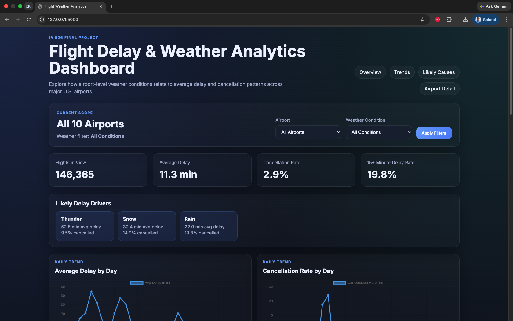
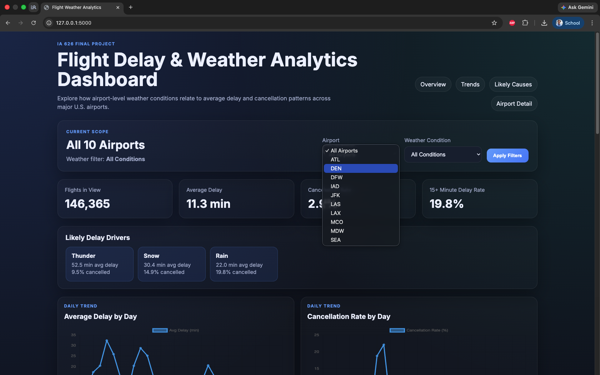
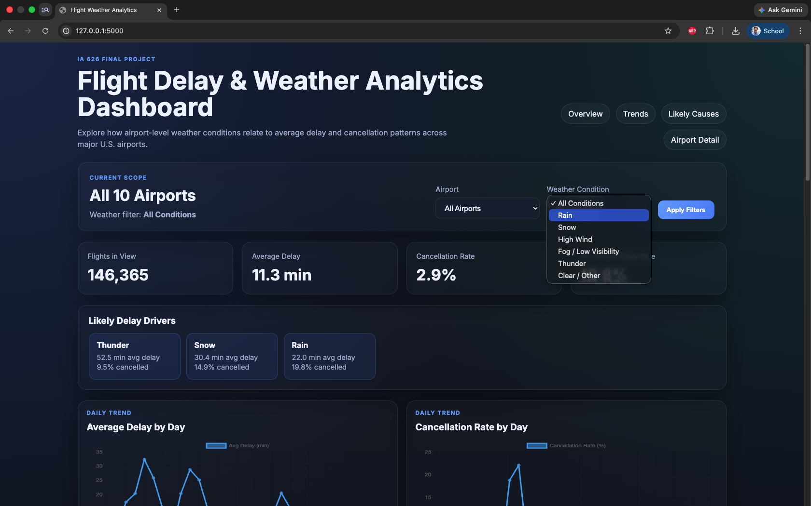
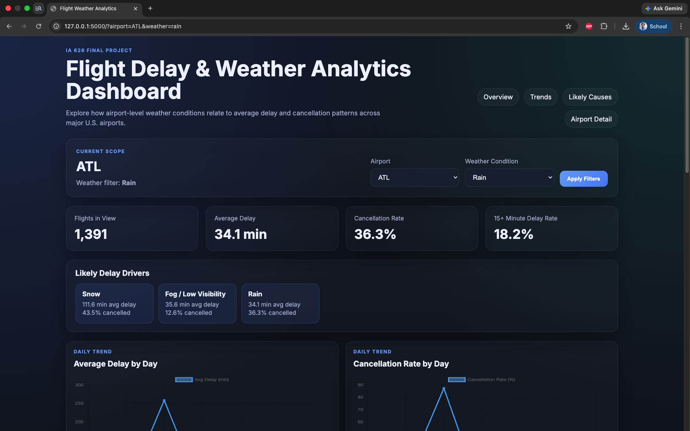
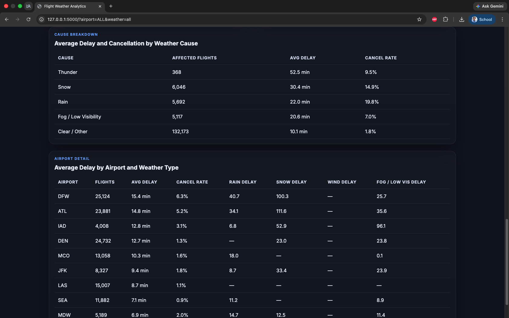

# Screenshots

Add screenshots of the dashboard here before final submission or job interview use.

## Suggested Screenshots

### 1. Full Dashboard Overview
Capture the landing page with:
- filter controls
- KPI cards
- trend charts
- airport comparison charts

### 2. Airport-Specific View
Show the dashboard filtered to one airport, such as ATL or DFW.

### 3. Weather-Specific View
Show the dashboard filtered to a weather condition, such as rain or snow.

### 4. Cause Breakdown Table
Capture the weather-cause summary table that compares average delay and cancellation rate.

## Suggested Naming
- `dashboard_overview.png`
- `dashboard_airport_filter.png`
- `dashboard_weather_filter.png`
- `dashboard_cause_breakdown.png`


```md

```

```md

```
```md

```
```md

```
```md

```